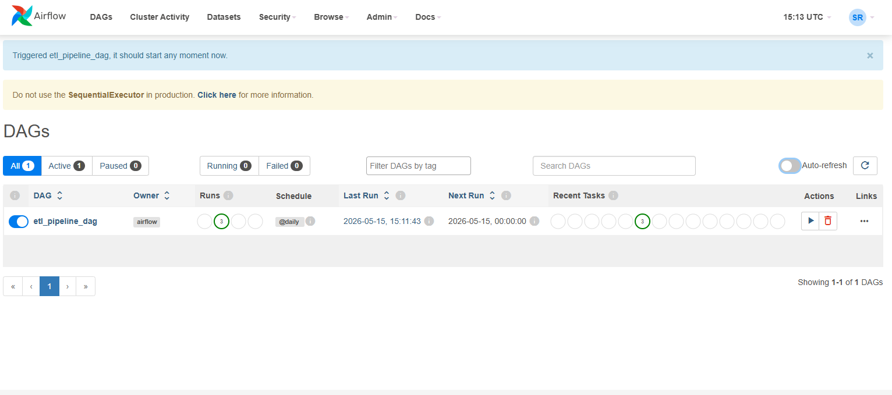
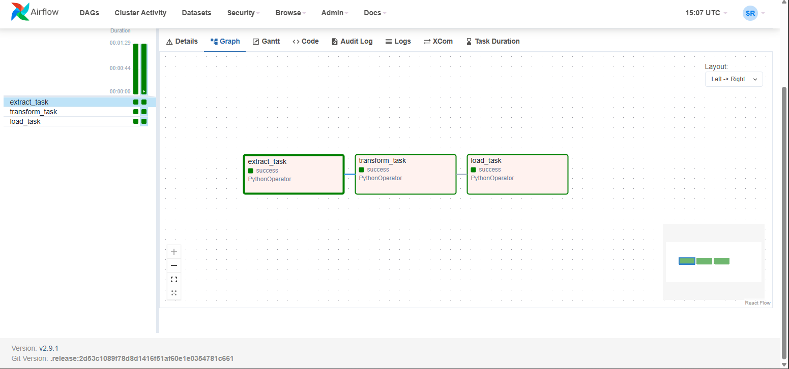
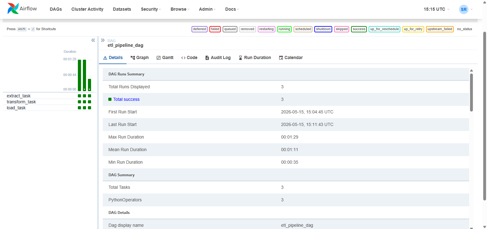
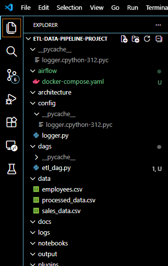

# ETL Data Pipeline Project

## Project Overview

This project demonstrates a complete ETL (Extract, Transform, Load) pipeline using Python, Apache Airflow, Docker, and PostgreSQL.

The pipeline extracts employee sales data from CSV files, transforms the data using Pandas, and loads the processed data into PostgreSQL using Airflow DAG orchestration.

---

# Technologies Used

- Python
- Apache Airflow
- Docker
- PostgreSQL
- Pandas
- GitHub

---

# ETL Workflow

1. Extract data from CSV files
2. Transform data using Python and Pandas
3. Load transformed data into PostgreSQL
4. Schedule and monitor pipeline using Airflow

---

# Project Structure

```bash
etl-data-pipeline-project/
│
├── airflow/
│   └── docker-compose.yaml
│
├── dags/
│   └── etl_dag.py
│
├── data/
│   ├── employees.csv
│   ├── sales_data.csv
│   └── processed_data.csv
│
├── config/
│   └── logger.py
│
├── screenshots/
│   ├── dag-dashboard.png
│   ├── dag-success-details.png
│   ├── graph-view.png
│   ├── docker-desktop-running.png
│   └── project-structure.png
│
├── extract.py
├── transform.py
├── load.py
├── run_pipeline.py
├── requirements.txt
├── README.md
└── .env
```

---

# Airflow DAG Screenshots

## DAG Dashboard



---

## DAG Graph View



---

## DAG Success Details



---

## Docker Running


---

## Project Structure



---

# How to Run Project

## Step 1

Clone repository

```bash
git clone <your-github-repo-link>
```

## Step 2

Move into project folder

```bash
cd etl-data-pipeline-project
```

## Step 3

Start Docker containers

```bash
docker compose up
```

## Step 4

Open Airflow UI

```bash
http://localhost:8080
```

---

# Airflow Login

Username

```bash
admin
```

Password

```bash
admin
```

---

# Features

- Automated ETL pipeline
- Airflow DAG orchestration
- Docker containerization
- PostgreSQL integration
- Logging support
- Modular project structure

---

# Future Improvements

- Kafka Integration
- AWS Deployment
- PySpark Processing
- Real-time Data Streaming
- CI/CD Pipeline

---

# Author

Sandeep Reddy